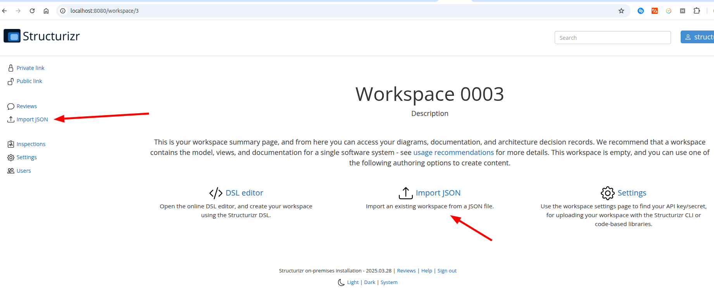
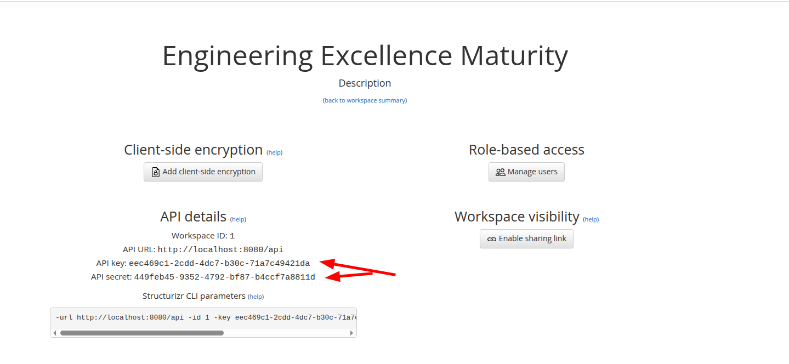
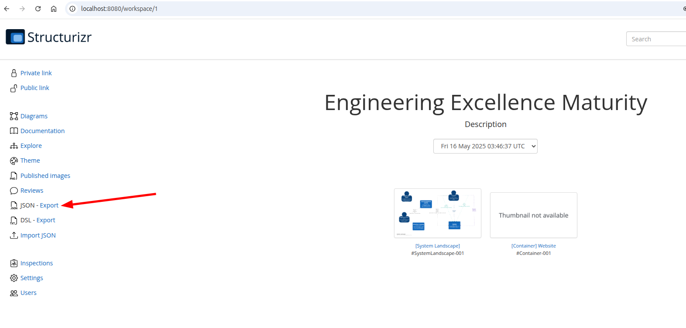
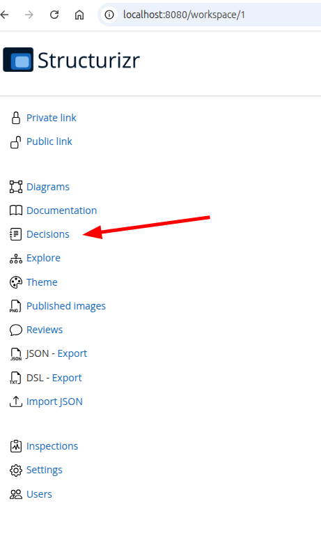
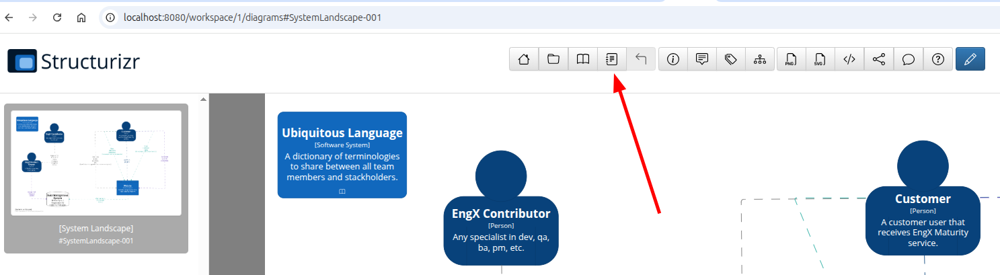

# Architecture as a code

- [Setup structurizr](#structurizr-local-run)
- [Make changes in diagrams](#making-changes)
- [Architecture Decision Records (ADRs)](#architecture-decisions)

## Structurizr Local Run

For viewing or editing the diagrams, architecture decision records (ADRs), and some documentation, I recommend using [Structurizr](https://structurizr.com/).

Sourcecode of diagrams is located in the arch/src folder. Whereas an infrastructure scripts to deploy structurizr localy and push a current workspace to it, the first time and after each change is located in /arch/infra.

### 1st step: run structurizr lite

Run docker compose /arch/infra/docker-compose.yml to run structurizr locally.
```shell 
  docker compose -f arch/infra/docker-compose.yml up -d
```
It will create a named volume Infra_structurizr where it will store all the data related to a workspace.

### 2nd step: create a workspace

Open page https://localhost:8080/ in the browser and sign in with default credentials
username: structurizr 
password: password

### 3d step: import existing DSLs and layouts

In the workspace home page find an import JSON link. and upload arch/manual_layouts/structurizr-1-workspace.json file.



## Making changes

### Changes in DSL files

In case you want to make changes and apply them locally, you need to set up api key and secret. For this open the workspace settings page



There is an API key and secret that has to be used later in the push_workspace.sh script.
I recommend adding these key and secret as environment variables, so you can just execute a push_workspace.sh script without modifying it, and so they do not leak into the git.

After each change of DSL files, run the push_workspace.sh script to compile and export changes to a local structurizr instance. 

```shell 
  ./push_workspace.sh <workspace_id> ../src/workspace.dsl
```

for example, ```./arch/infra/push_workspace.sh 1 ./arch/src/workspace.dsl```

> this script has default values for its arguments:
> - workspace_id by default is **1**
> - dsl file by default is **./arch/src/workspace.dsl**
> 
> in this case you can execute the script from the project root folder as ```shell ./arch/infra/pusj_workspace.sh``` without any arguments.


### Changes in layouts

Sometimes there is a need manually to change the layout of a diagram. You can do so by editting a diagram. 

In order to save a new layout, please go to the workspace home page and export workspace as JSON into arch/manual_layouts/structurizr-1-workspace.json



## Architecture Decisions

A page with existing ADRs in structurizr can be navigated either from a left side menu (Decisions) or from each diagram, from a toolbar icon.

